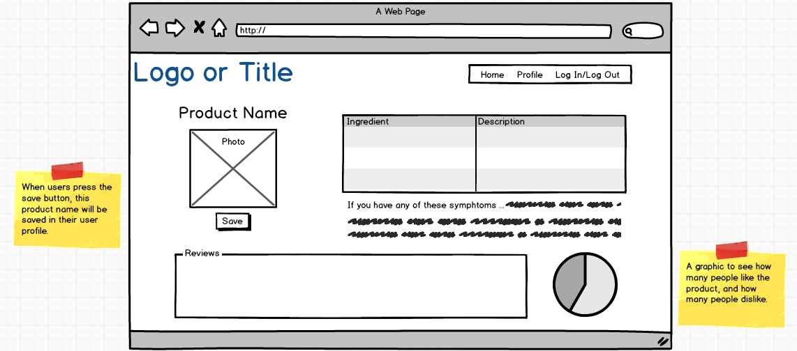

# Project 3 (name TBD) - Group: Esraa, Francheska, Naomi
-----------------------

An app for people who care about the ingredients they're buying! Quickly and easily take a picture of the ingredient list or barcode of a product such as shampoo, energy bar, baby food, soap, chap stick, cookie, or pretty much anything, and the app will give you more information about each ingredient from that long and hard to read list of ingredients.

If you have any kind of allergies, dietary restrictions, such as gluten-free, vegetarian, lactose-intolerant, or cultural preferences such as Halal or Kosher you can easily log in, build a user profile, and save your unique preferences.

## Wireframes
----------

### Homepage:

### Product-Info Page:

### User-Profile:

## User Stories
------------

- As a user, I want to quickly and easily take a picture of the info section of a product and immediately see if the product contains any ingredients I don't want to buy. 

- As a user, I want to 'red flag' ingredients I am careful about. Such as items I am allergic to examples include: peanuts, gluten, dairy, etc. and/or culturally/religiously specific items examples include: Halal, Kosher, vegetarian, etc..

- As a user, I want to login to my account where I can save my unique preferences and ingredient list in a user profile.

- As a user, I want to be able to edit/update/delete my saved product ingredients on my user profile.

##  Pseudocode
----------

Here is the initial thinking we started with:

## ERD or other visual representation of your database
---

** Need to add this on Tuesday **

## Technologies used/npm Modules
-----------

### Core Stack:
- React
- Node
- Express
- PostgreSQL
- JavaScript
- jQuery
- HTML
- CSS

### Additional components:

### APIs:
- Google Cloud Optical Character Recognition (OCR) API

- POTENTIAL APIs: 
- https://www.textibility.com 
- https://www.foodallergy.org
- https://www.nutritionix.com
- http://developer.clarifai.com

### Middleware:
- nodemon
- pg-promise
- AuthO
- React-Routers
- CSS Frameworks
- and more...

## Download Project & Install
----------------

1. Git clone or download this project
2. Create a PostgreSQL database called 'TBD'
3. On your terminal, navigate to the models folder and run `psql  -f TBD.sql`
4. Make sure to npm install nodemon --save
5. Run nodemon, and app should be available on localhost:3000

# Live Deployment Here: URL