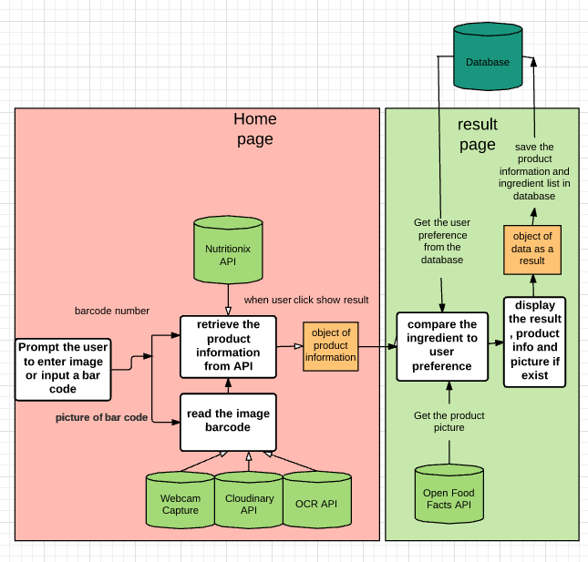
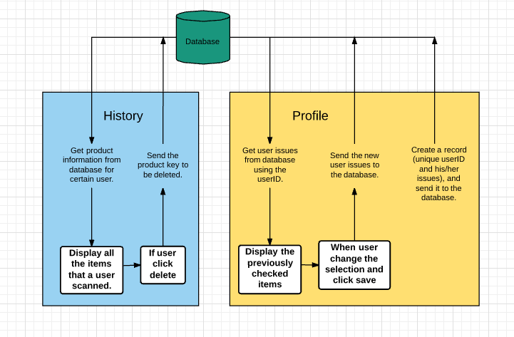

<a name="goback">

# Project 3 (Can I Eat This?)

</a>

### Group 7: Esraa, Francheska, Naomi

## Table of Content

1. [App description](#appdescription)
2. [User Stories](#userstories)
3. [Wireframes Web Version](#wireframesweb)
4. [Wireframes Mobile Version](#wireframesmobile)
5. [Visual representation of the database](#database)
6. [Pseudocode](#pseudocode)
7. [APP flowChart](#workflow)
8. [ERD or other visual representation of your database](#database)
9. [Technologies used](#technologies)
10. [Ways to see the project](#project)

<a name="appdescription">

## App description

An app for people who care about the ingredients they're buying! Quickly and easily take a picture of the ingredient list or barcode of a product such as cereal, snacks, or pretty much anything, and the app will give you more information about each ingredient from that long and hard to read list of ingredients.

If you have a kind of allergies or dietary restrictions, you can select your issues from profile, and save your unique preferences.

-	Allergens

	-	Peanut
	-	Tree Nuts
	-	Milk
	-	Egg
	-	Wheat
	-	Soy
	-	Fish
	-	Shellfish
	-	Sesame

This APP gets the product's ingredient and search it for more than 60 keywords to tell the user if this product is for him/her.

This APP has an external database to store product information and Users' Issues.

</a>

<a name="userstories">

## User Stories

- As a user, I want to use the app in the mobile and/or browser.

- As a user I want to know if I'm using wrong number of digits or letters by mistake.

- As a user, I want to add and edit the ingredients I am careful about in the User Profile.

- As a user, I want to quickly and easily take a picture of the product's barcode , and immediately see if the product contains any ingredients I don't want to buy. 

- As a user, I want the option to write the barcode (maybe is the user's preferred way for security reasons, or camera doesn't work, etc), and immediately see if the product contains any ingredients I don't want to buy.

- As a user, I want to 'red flag' ingredients I am careful about. Such as items I am allergic to examples include: peanuts, gluten, dairy, etc. 

- As a user, I want a history of all the products I already look up, and be able to delete it.
- As a user I want to see the product picture if avaliable and see the ingredients.

</a>

<a name="wireframesweb">

## Wireframes (Web Version)

### Here is the initial thinking we started with:

### Homepage:

### Product Info:

### User Profile:

### History:

</a>

<a name="wireframesmobile">

## Wireframes (Mobile Version)

### Homepage, Scan Barcode and Product Info:

### User Profile and History:

</a>

<a name="pseudocode">

## Pseudocode

1. Grab the item barcode (by scanning the UPC number, or write it in an input field).
2. validate the barcode , It should be 12 digits number.
3. Make an axios call to find the product information (product name, ingredients).
4.	Use the barcode to call another API for the picture 
5.	Get the user list of allergies from the Database
6.	Compare the product ingredients the user’s allergies 
7.	Store the comparison information from the two API to database 
8.	Display for the user the picture of the product if found or use a placeholder
9.	To change the user issues, the user can click on profile page
10.	The previously selected issues will be displayed and the user can modify his/her selection. 
11.	If the user wants to see the previously searched items, s/he can click on History page. 
12.	Deleting a product is possible by clicking on X
13.	For wrong links , 404 page is available.

</a>

<a name="database">

## ERD or other visual representation of your database

</a>

<a name="technologies">

## Technologies used

### Core Stack:

- HTML
- CSS
- JavaScript
- jQuery
- React
- Node
- Express
- PostgreSQL
- Postman
- Heroku
- GitHub

### Middleware:

- nodemon
- pg-promise
- Axios
- AuthO
- React-Routers
- CSS Frameworks
- cors
- bluebird
- and more...

### APIs:

- Google Cloud Optical Character Recognition (OCR) API
- Get information of the product: https://www.nutritionix.com
- Get image of the product:

</a>

<a name="project">

## Ways to see the project

### Download Project & Install

1. Git clone or download this project
2. Create a PostgreSQL database called 'TBD'
3. On your terminal, navigate to the models folder and run `psql  -f TBD.sql`
4. Make sure to npm install nodemon --save
5. Run nodemon, and app should be available on localhost:3000

### Live Deployment Here: 

URL 

- Database URL on Heroku 
- https://caneatthis.herokuapp.com
- To access the products information
- https://caneatthis.herokuapp.com/api/information
- To access the users issues
- https://caneatthis.herokuapp.com/api/allergies

</a>

[Go Back to the Table of Content](#goback)
