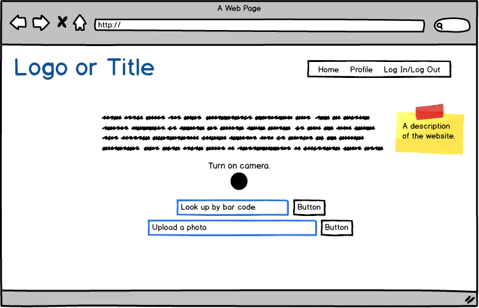
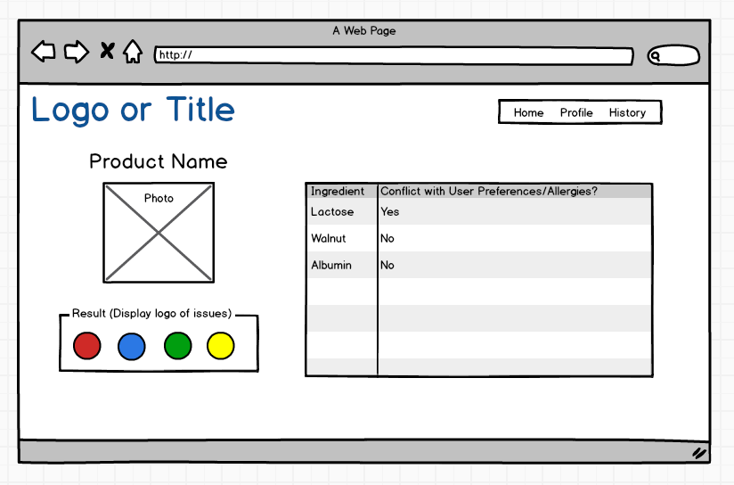
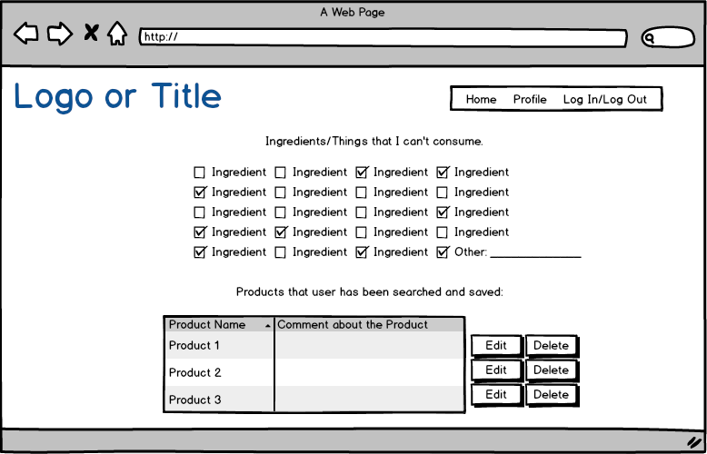
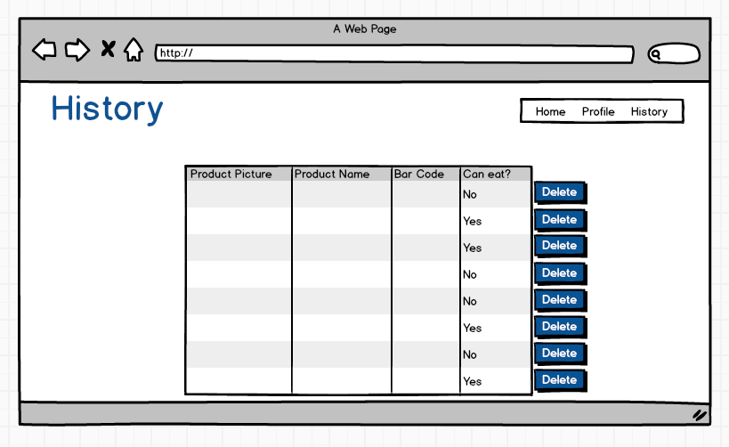
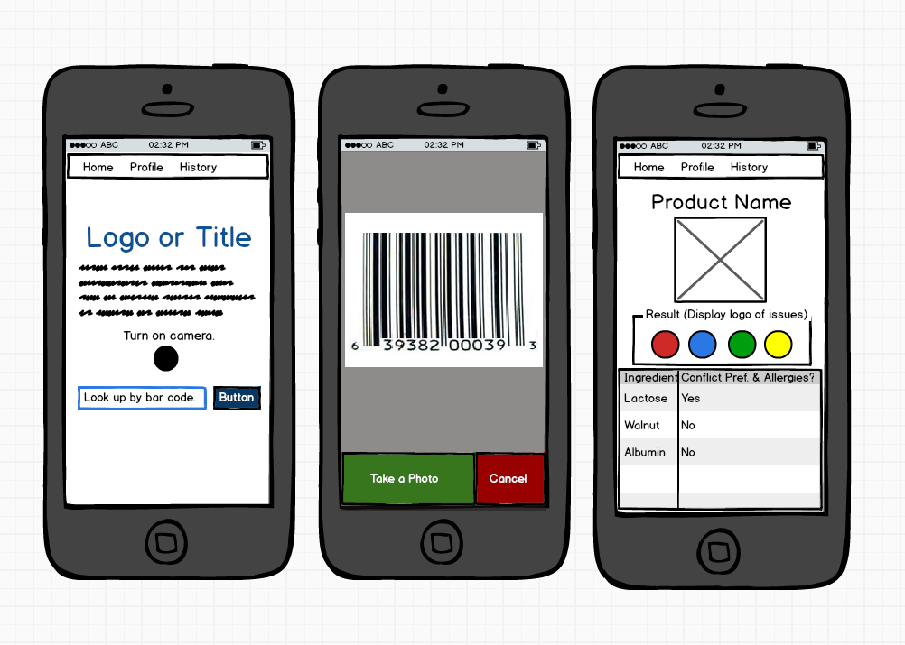
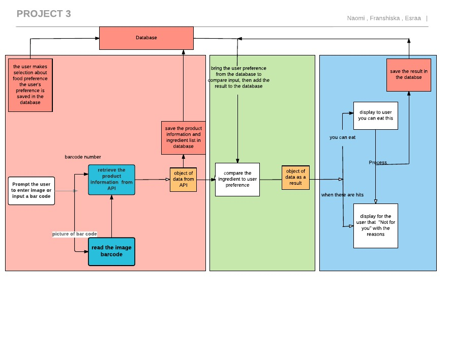
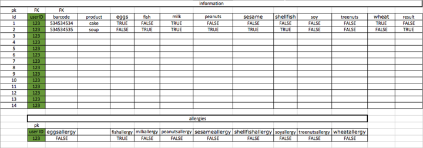

<a name="goback">
#Project 3 (Can I Eat This?)
</a>

###Group 7: Esraa, Francheska, Naomi

##Table of Content

1. [App description](#appdescription)
2. [User Stories](#userstories)
3. [Wireframes Web Version](#wireframesweb)
4. [Wireframes Mobile Version](#wireframesmobile)
5. [Visual representation of the database](#database)
6. [Pseudocode](#pseudocode)
7. [Workflow](#workflow)
8. [ERD or other visual representation of your database](#database)
9. [Technologies used](#technologies)
10. [Ways to see the project](#project)

<a name="appdescription">
##App description

An app for people who care about the ingredients they're buying! Quickly and easily take a picture of the ingredient list or barcode of a product such as cereal, snacks, or pretty much anything, and the app will give you more information about each ingredient from that long and hard to read list of ingredients.

If you have any kind of allergies, dietary restrictions, such as gluten-free, vegetarian, lactose-intolerant, or cultural preferences such as Halal or Kosher you can easily log in, build a user profile, and save your unique preferences.
</a>

<a name="userstories">
##User Stories

- As a user, I want to quickly and easily take a picture of the info section of a product and immediately see if the product contains any ingredients I don't want to buy. 

- As a user, I want to 'red flag' ingredients I am careful about. Such as items I am allergic to examples include: peanuts, gluten, dairy, etc. and/or culturally/religiously specific items examples include: Halal, Kosher, vegetarian, etc..

- As a user, I want to login to my account where I can save my unique preferences and ingredient list in a user profile.

- As a user, I want to be able to edit/update/delete my saved product ingredients on my user profile.
</a>

<a name="wireframesweb">
##Wireframes (Web Version)

###Here is the initial thinking we started with:

###Homepage:

###Product Info:

### User Profile:

###History:

</a>

<a name="wireframesmobile">
##Wireframes (Mobile Version)

###Homepage, Scan Barcode and Product Info:

###User Profile and History:

</a>

<a name="pseudocode">
##Pseudocode
</a>

<a name="workflow">
##Workflow

1. Grab the item barcode (by scanning the UPC number, or write it in an input field).
2. Make an axios call to find the product information (product name, ingredients).
3. Save the product information in the database.
4. Get the user allergies information, and save it the database.
5. Compare the product ingredients with the user allergies, and generate a result.
6. Display the result to the user.

</a>

<a name="database">
##ERD or other visual representation of your database

</a>

<a name="technologies">
##Technologies used

###Core Stack:
- HTML
- CSS
- JavaScript
- jQuery
- React
- Node
- Express
- PostgreSQL
- Heroku
- GitHub

###Middleware:

- nodemon
- pg-promise
- AuthO
- React-Routers
- CSS Frameworks
- and more...

###APIs:

- Google Cloud Optical Character Recognition (OCR) API
- https://www.nutritionix.com
</a>

<a name="project">
##Ways to see the project

### Download Project & Install

1. Git clone or download this project
2. Create a PostgreSQL database called 'TBD'
3. On your terminal, navigate to the models folder and run `psql  -f TBD.sql`
4. Make sure to npm install nodemon --save
5. Run nodemon, and app should be available on localhost:3000

###Live Deployment Here: 

URL 
</a>

[Go Back to the Table of Content](#goback)
